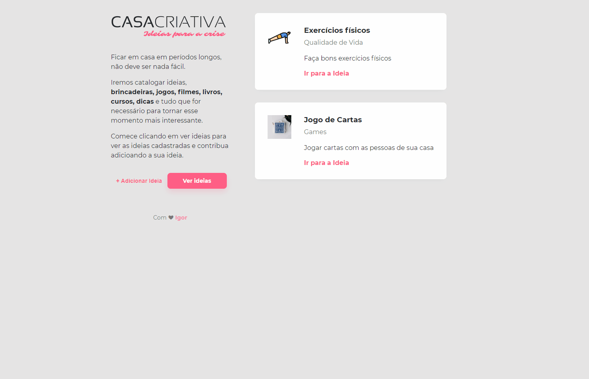

<h1 align="center">
    
    <br>
</h1>
<h4 align="center">
  Compartilhe atividades de lazer na quarentena. 
</h4>
<h4 align="center">
  Share leisure activities in quarantine.
</h4>
<p align="center">
  <a href="#rocket-technologies">Technologies</a>&nbsp;&nbsp;&nbsp;|&nbsp;&nbsp;&nbsp;
  <a href="#information_source-how-to-use">How To Use</a>&nbsp;&nbsp;&nbsp;|&nbsp;&nbsp;&nbsp;
  <a href="#memo-license">License</a>
</p>


<p align="center">
  
</p>

## :rocket: Technologies
This project was developed with the following technologies:
-  [Node.js](https://nodejs.org/en/)
-  [JavaScript](https://www.javascript.com/)
-  [CSS](https://www.w3schools.com/css/)

## :information_source: How To Use
To clone and run this application, you'll need [Git](https://git-scm.com), [Node.js v10.16][nodejs]. From your command line:
```bash
# Clone this repository
$ git clone https://github.com/IgorMarchi/ProjetoCasaCriativa CasaCriativa
# Go into the repository
$ cd CasaCriativa
# Install dependencies
$ npm install
```
## :memo: License
This project is under the MIT license. See the [LICENSE](https://github.com/IgorMarchi/ProjetoCasaCriativa/blob/master/LICENSE) for more information.
